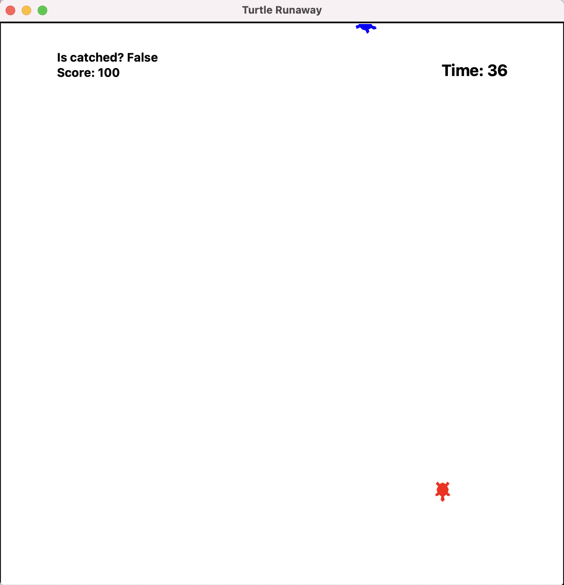

# Turtle Runaway #

### 게임 설명 ###


- 파랑 거북이가 빨강 거북이를 피해 도망다닙니다. 
- 빨강 거북이(플레이어)는 제한시간 60초 이내에 파랑 거북이를 잡으러 다닙니다.


- 한번 잡으면 점수는 100 단위로 획득하며 파랑 거북이는 빠르게 다시 도망 갑니다.
- 게임이 끝날 때까지 많은 점수를 획득하는 것이 목표입니다.

### 게임오버 ###


- 제한 시간 60초가 끝나면 화면 상에 Game Over 문구가 뜹니다.
- 더 이상 파랑 거북이를 잡아도 점수를 획득하지 못합니다.

### 추가한 코드 설명. ###
- 타이머 기능(제한시간).
```python
class RunawayGame:
    def __init__(self, canvas, runner, chaser, catch_radius=50):
        # time 변수 추가 (초기화는 60초로 설함함)
        self.time = 60
        # 타이머 draw를 위해 필요한 부분들을 선언.
        self.timer_drawer = turtle.RawTurtle(canvas)
        self.timer_drawer.hideturtle()
        self.timer_drawer.penup()
```
```python
class RunawayGame:
    ...
    # 타이머 계산 및 시각화
    def renew_time(self):
        self.timer_drawer.undo()
        self.timer_drawer.penup()
        self.timer_drawer.setpos(200,280)
        # 화면 상에 시간 표시.
        self.timer_drawer.write(f'Time: {self.time}', font=("System", 20, "bold"))
        if self.time > 0:
            self.time -= 1
            # 1초마다 renew_time 함수 실행하도록 설정.
            self.canvas.ontimer(self.renew_time, 1000)
        else:
            # time 변수가 0일 경우 호출할 함수.
            self.game_over()
```
- 점수 기능.
```python
class RunawayGame:
    def __init__(self, canvas, runner, chaser, catch_radius=50):
        # score 변수 추가 (초기화는 0으로 설정)
        self.score = 0
        ...

    def step(self):
        ...
        if is_catched and not(self.is_gameover):
            self.runner.setpos(-self.runner.xcor(), -self.runner.ycor())
            self.score += 100 # score 값을 100올림.
        # 점수를 화면 상에 표현
        self.drawer.write(f'Is catched? {is_catched}\nScore: {self.score}', font=("System", 15, "bold"))
        ...
```
- 게임 오버시 문구 표현 및 점수 오름 방지.
```python
# game over시 실행 함수
    def game_over(self):
        # is_gameover 값을 True로 변경.
        self.is_gameover = True
        self.game_over_drawer.penup()
        self.game_over_drawer.setpos(0,0)
        # 화면 중간에 Game Over 문구를 띄움.
        self.game_over_drawer.write('Game Over', align="center", font=("System", 30, "bold"))
```
```python
    def step(self):
        ...
        if is_catched and not(self.is_gameover): # gameover시 점수 오름 방지.
            self.runner.setpos(-self.runner.xcor(), -self.runner.ycor())
            self.score += 100
        ...
```

- runner 거북이(파랑 거북이)가 잡혔을 시 좌표상 대칭 방향으로 이동. & runner 거북이(파랑 거북이)가 화면 상 밖으로 나가지 못하도록 방지.
```python
class RunawayGame:
    def step(self):
        # runner 거북이가 선 밖으로 나가지 못하게 수정.
        # 경계에 닿으면 180도 회전 후 앞방향으로 10만큼 이동해 나가지 못하게 함.
        if self.runner.xcor() > 350 or self.runner.xcor() < -350:
            self.runner.right(180)
            self.runner.forward(10)
        if self.runner.ycor() > 350 or self.runner.ycor() < -350:
            self.runner.right(180)
            self.runner.forward(10)
        ...
        # 잡으면 점수를 획득
        if is_catched and not(self.is_gameover):
            # runner가 좌표상 대칭방향으로 이동
            self.runner.setpos(-self.runner.xcor(), -self.runner.ycor())
            self.score += 100
        ...
```